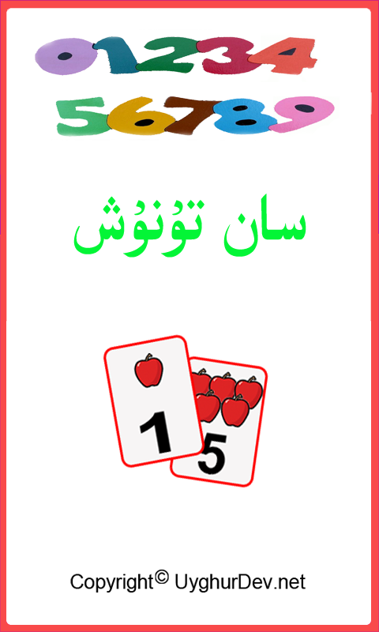
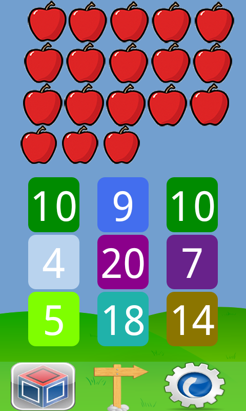

Numbers
=======

Numbers for Kids. Teaches kids to recognize numbers within 20. This app aims to educate kids between 2 to 6 years old.

ئىككى ياشتىن ئالتە ياشقىچە بولغان بالىلارنىڭ 20 ئىچىدىكى سانلارنىڭ ئوقۇلىشىنى ئاڭلاپ رەسىمگە قاراپ تۇنۇش، ئۆگۈنۈپ بولغان سانلارنى باشقا سانلار ئارىسىدىن پەرقلەندۈرۈپ تېپىش، ئۆزى مۇستەقىل ھالدا 20 گىچە ساناش تەلەپ قىلىدىغان، مەشغۇلات جەريانى قولاي مائارىپ تەربىيەلەش خارەكتىردىكى ئەپ.

Screenshots
---------

Download Link
---------
* [Download from Bilkan Bazar](http://bazar.bilkan.net/App.aspx?id=78)

Similar Projects
---------
* [Four Operators](https://github.com/Bilkan/FourOperators)
* [Shapes](https://github.com/Bilkan/Shapes)
* [Plants](https://github.com/Bilkan/Plants)
* [Colors](https://github.com/Bilkan/Colors)
* [Compare](https://github.com/Bilkan/Compare)
